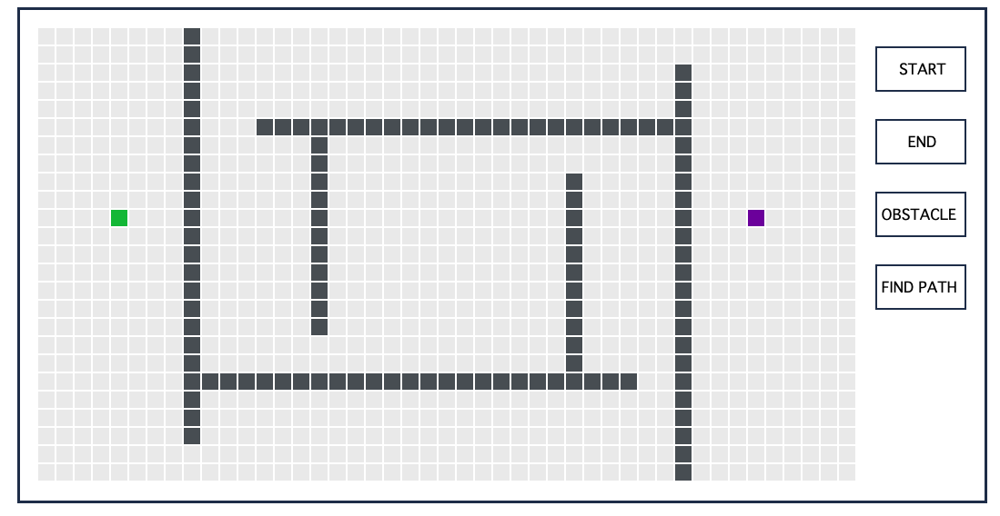
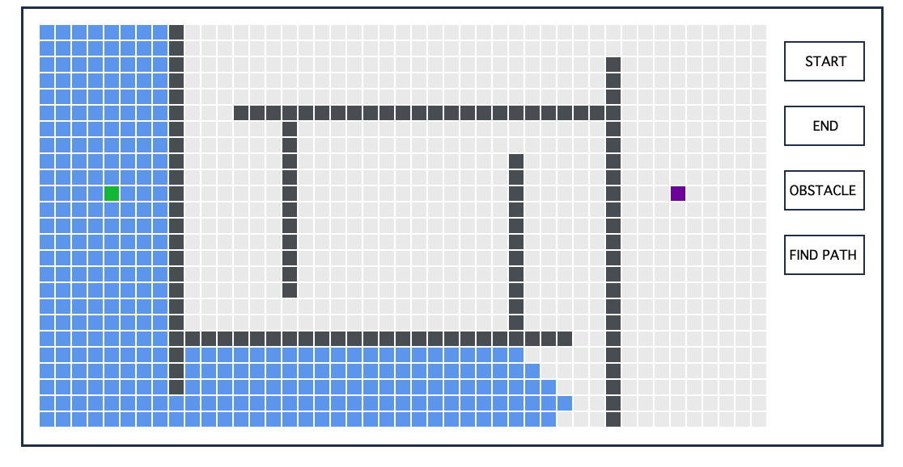
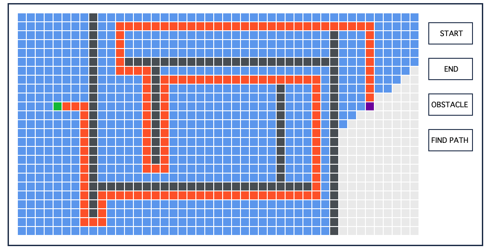

# Path Finding Algorithm
This project is an implementation of a simple path finding algorithm. It finds the shortest way between the start point and the end point, while omitting obstacles. All those locations are placed by user on the grid. The project was written in JavaScript, in the repo I don't deliver HTML and CSS files.

 ## Getting started

 ### Running app
 Firstly, the the start location (green cell), the end location (purple cell) and obstacles (black cells), which are not obligatory are pointed by the user. 
 
 
 
 Then the algorithm findes the shortes path beetwen the start point and the end point, while omitting obstacles. Algorithm works in the way, that in evert time step it extends its already examined region of search. It is made by calculating, if cells around the periphery of the region are the goal. If not, they are marged into already examined region. 
 
  

 If the goal is reached, the shorthest way from the goal to the start point is displayed. 

  